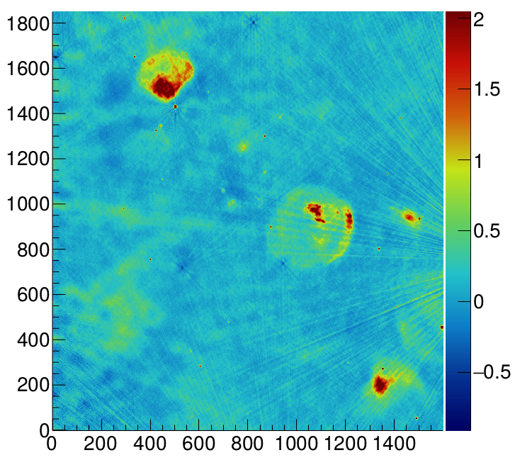
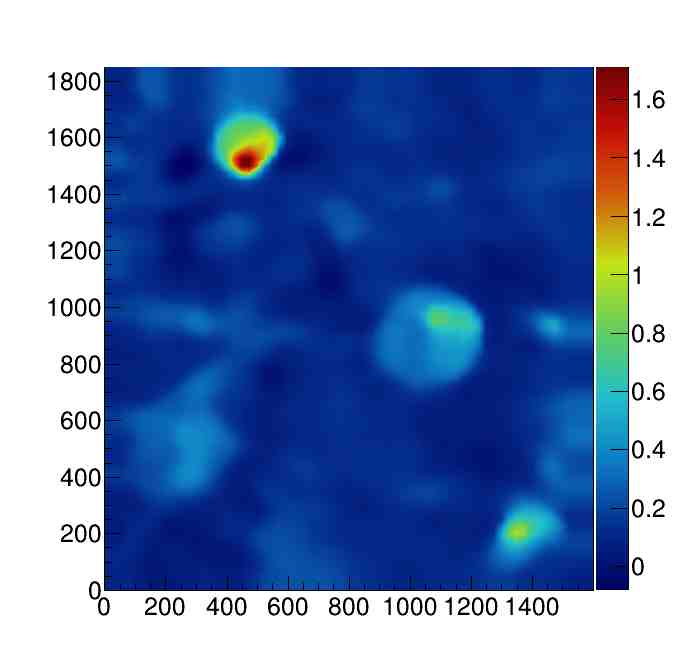
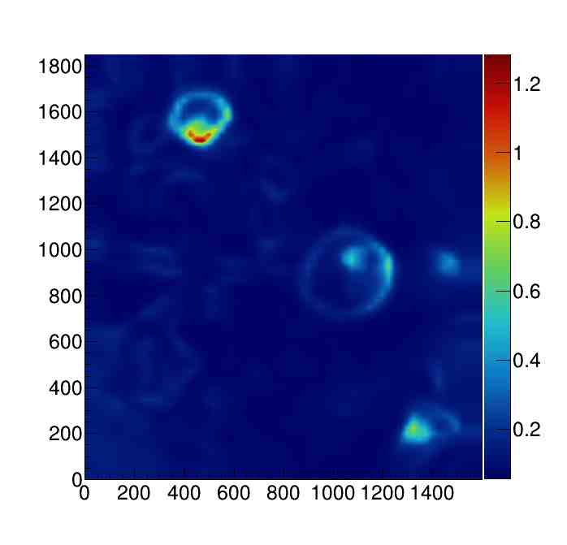
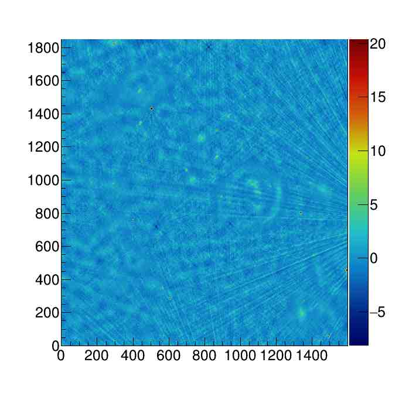

Compute image background info 
=============================

Say you have a FITS image (e.g. `input.fits`) with your radio observations and you want to estimate the background and noise maps.   
You can use the executable ``FindBkg`` installed in the CAESAR `bin` directory to this aim:    

.. code:: bash

    $ ./FindBkg [options]
        
    =========== USAGE ===========
    Usage: FindBkg [options]

    *** Mandatory options ***
    --input=[FILENAME] - Input file name containing image to be read (NB: .fits/.root supported)

    *** Optional options ***
    -h, --help - Show help message and exit
    --boxsize=[SIZE] - Size of sampling box in pixels or expressed as a multiple of the image beam size (if --sizeinbeam option is given) (default=100 pixels)
    --sizeinbeam - Consider box size option expressed in multiple of beam size (beam info read from image) (default=no)
    --gridsize=[SIZE] - Size of the interpolation grid expressed as fraction of the sampling box (default=0.25)
    --estimator=[ESTIMATOR] - Bkg estimator used in the sampling box (1=mean, 2=median, 3=biweight, 4=clipped median) (default=2)
    --2ndpass - If given, perform a 2nd pass in bkg calculation (default=no)
    --skipblobs - If given, skip blobs using a flood-fill algorithm (default=no)
    --seedthr=[NSIGMAS] - Seed threshold in flood-fill algorithm in nsigmas significance (default=5)
    --mergethr=[NSIGMAS] - Merge threshold in flood-fill algorithm in nsigmas significance (default=2.6)
    --minnpixels=[NPIX] - Minimum number of pixels in a blob (default=5)
    --nthreads=[N] - Number of threads to be used for reading (-1=all available threads) (default=1)
    --output=[FILENAME] - ROOT file where to save output maps (default=bkg.root)
    --output-bkg=[FILENAME] - FITS file where to save bkg map (if --fitsout is given) (default=bkg.fits)
    --output-rms=[FILENAME] - FITS file where to save rms map (if --fitsout is given) (default=rms.fits)
    --significance - Save the significance map (along with bkg and noise maps) in output file (default=no)
    --output-significance=[FILENAME] - FITS file where to save significance map (if --fitsout is given) (default=significance.fits)
    --fitsout - Write results in FITS files (default=no)
    --parallel - Use parallel std algorithms for median (default=no)
    -v [LEVEL], --verbosity=[LEVEL] - Log level (<=0=OFF, 1=FATAL, 2=ERROR, 3=WARN, 4=INFO, >=5=DEBUG) (default=INFO)
    ==============================

As you can imagine, the `FindBkg` example simply uses the CAESAR ``Image`` and ``BkgFinder`` class methods. 
The meaning of each command line option is briefly reported in the program help in brief and in the configuration option section. 
More details on the algorithm used to compute the background maps are given in the CAESAR reference papers (see citing & reference section).

The example produces a ROOT file (with name specified in the `output` option) with three CAESAR image object stored:    

- `bkgMap`: the background map
- `rmsMap`: the noise map
- `significanceMap`: the significance map computed as (img-bkg)/noise   

You can access (read, plot, manipulate) these maps using ROOT CLI or macros. if you are not familiar with ROOT here's a macro example (say it is called macro.C).

.. code::

    //Open file (you can see file content in ROOT CLI by typing '.ls' at the root prompt)
    TFile* inputFile= new TFile("bkg.root","READ");

    //Get access to significance map   
    Image* zmap= (Image*)inputFile->Get("significanceMap");

    //Draw the map with COLZ option
    zmap->SetStats(0);//disable drawing of stats box in canvas   
    zmap->GetHisto2D("")->Draw("COLZ");   

    //Do whatever you want with Image API, e.g. compute & print stats    
    zmap->ComputeStats(true);   
    zmap->PrintStats();   

If the ``--fitsout`` option is given three distinct fits files are produced with background, rms and significance maps (if ``--significance`` option is given). 
The images below show the results of this background finder run on a sample image provided in this repository (`data/ScorpioSNRField.fits`):

``FindBkg --input=ScorpioSNRField.fits --boxsize=20 --sizeinbeam --significance --fitsout``

    
    Input image (units: mJy/beam)

    Bkg map (units: mJy/beam)

    
    Noise map (units: mJy/beam)

    
    Significance map (units: nsigmas)

