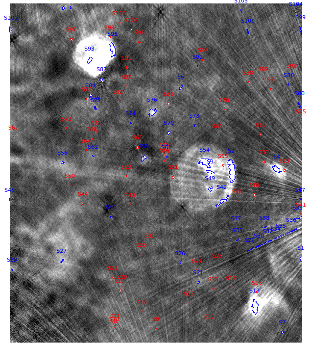

Extracting compact sources
==========================

Say you have a FITS image (e.g. `input.fits`) with your radio observations and you want to extract compact and point-sources. You can use the executable ``FindSource`` or ``FindSourceMPI`` (which supports parallel computation) installed in the CAESAR `bin` directory to this aim:    
   
.. code:: bash

    $ ./FindSource --config=[config file]

.. code:: bash

    $ mpirun -np [NPROC] ./FindSourceMPI --config=[config file] [--no-mpi]
        

A sample configuration file to search sources in the test image `ScorpioSNRField.fits` is reported below: 

.. code:: bash

    #===================    
    #==    MAIN       ==     
    #===================    
    inputFile = ScorpioSNRField.fits                    | Input image filename (ROOT or FITS)     
    ##      
    //===========================
    //==   BKG OPTIONS         == 
    //===========================
    useLocalBkg = true																	| Use local background calculation instead of global bkg (T/F)
    bkgEstimator = 2																		| Background estimator (1=Mean,2=Median,3=BiWeight,4=ClippedMedian)
    useBeamInfoInBkg = true                             | Use beam information in bkg box definition (if available) (T/F)
    boxSizeX = 20																			  | X Size of local background box in #pixels
    boxSizeY = 20																			  | Y Size of local background box in #pixels
    gridSizeX = 0.2																			| X Size of local background grid used for bkg interpolation
    gridSizeY = 0.2																			| Y Size of local background grid used for bkg interpolation
    ###
    ###
    //====================================
    //==  SOURCE FINDING OPTIONS        ==
    //====================================
    searchCompactSources = true													| Search compact sources (T/F)
    minNPix = 5																				  | Minimum number of pixel to consider a source
    seedThr = 5 																				| Seed threshold in flood filling algo for faint sources
    mergeThr = 2.6																			| Merge/aggregation threshold in flood filling algo
    compactSourceSearchNIters = 2                       | Number of iterations to be performed in compact source search (default=10)
    seedThrStep = 0.5                                   | Seed threshold decrease step size between iteration (default=1)
    ###
    ###
    //===========================================
    //==  NESTED SOURCE FINDING OPTIONS        ==
    //===========================================
    searchNestedSources = false													| Search for nested sources inside candidate sources (T/F)
    //==================================
    //==  SOURCE FITTING OPTIONS      ==
    //==================================
    fitSources = false                                  | Fit sources with multi-component gaus fit (T/F)

With the above configuration, after computing the significance map, the image is scanned for compact sources with a flood-fill algorithm, assuming a seed significance threshold of 5 sigmas and an aggregation threshold of 2.6 sigmas. A minimum number of pixels equal to 5 is considered in blob finding. Two search iterations are performed, decreasing detection threshold by 0.5 sigmas at each iterations. No negative excess wrt background are searched. No nested sources are searched. No fitting is performed over the detected sources.   

A region file is created with the detected source as well as a ROOT file with full source information stored in the `SourceInfo` ROOT TTree. Each source in the tree is a `Source` object. You can view the original image with detected sources in DS9 as:

    $ ds9 ScorpioSNRField.fits -regions ds9.reg
 
The image below shows the compact sources detected in the sample field 

    Input image with detected compact sources (blue lines) and point-sources (red lines)

You can also get full access to detailed source info (parameters, contours, etc) from the ROOT output file using macros, CLI, etc. Source info is stored in the `SourceInfo` ROOT tree. For example, the following code gets access to all detected sources and dumps some basic source parameters:    
    
.. code:: cpp

    {     
      //Open output file with source finding results    
      TFile* f= new TFile("output.root","READ");

      //Get access to source data tree    
      TTree* data= (TTree*)f->Get("SourceInfo");     

      Source* source= 0;    
      data->SetBranchAddress("Source",&source);    
      
      //Loop over all detected sources    
      for(int i=0;i<data->GetEntries();i++)
      {
         //Get i-th source   
         data->GetEntry(i);    

         //Dump source info    
         source->Print();      

         //Do other stuff with i-th source object (see Source API)    
         //...     
      }    
    }
